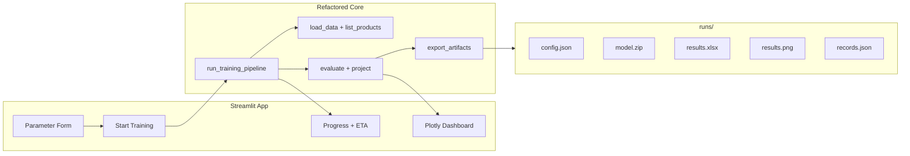

# Streamlit UI + Interaktives Dashboard

## Entscheidungen (aus Interview)

| Thema | Entscheidung |
|---|---|
| Stack | **Streamlit + Plotly** |
| Parameter | **Alle** trainings-/umgebungsrelevanten Parameter |
| Daten | **Fixe Sample-Excel**; Product/Location per **Dropdown** |
| Run-History in UI | **Später** — jetzt nur Speicherung auf Disk + Anzeige des aktuellen Laufs |
| UI-Sprache | **Englisch** |
| Run-Ordner | `runs/2026-06-11_143045_ice-cream-strawberry/` |
| Artefakte | Vollständiges, sinnvolles Paket (siehe unten) |

## Architektur



## 1. Core refactoren ([inventory_ppo.py](inventory_ppo.py))

Die bestehende `main()`-Logik wird in wiederverwendbare Funktionen extrahiert, damit CLI und UI denselben Codepfad nutzen:

- **`list_product_location_pairs(file_path) -> list[tuple[str,str]]`** — liest einmalig die Excel-Sheets und liefert gültige Product/Location-Kombinationen für Dropdowns
- **`TrainingConfig` (dataclass)** — alle Parameter an einem Ort:
  - Daten: `file_path` (fix: `Sample Data RL4IM UPDATED.xlsx`), `product`, `location`
  - Training: `timesteps`, `learning_rate`
  - Environment: `holding_cost`, `ordering_cost`, `lost_sales_cost`, `max_order_qty`, `n_forecast_weeks`
  - Optional PPO-relevant: `gamma`, `n_steps`, `batch_size` (Defaults aus SB3, in „Advanced“-Expander)
- **`run_training_pipeline(config, progress_callback=None) -> RunResult`** — kapselt: Daten laden → Env → `PPO.learn()` → Evaluation → Forward Projection → Artefakte speichern
- **`ProgressCallback(BaseCallback)`** — meldet `current_step / total_timesteps`; UI nutzt das für `st.progress()` und ETA:  
  `eta_sec ≈ elapsed / done * (total - done)`
- **`save_run_artifacts(run_dir, ...)`** — schreibt alle Dateien in den Run-Ordner
- **`main()`** bleibt erhalten und ruft intern `run_training_pipeline()` auf (CLI-Kompatibilität)

Hardcodierte Werte wie `max_order_qty=200` in Zeile 533 werden durch `TrainingConfig` ersetzt (Default 200 beibehalten).

## 2. Run-Verzeichnis-Struktur

Neuer Ordner: [`runs/`](runs/) (mit `.gitkeep`; Inhalte in `.gitignore`)

Pro Lauf:

```
runs/2026-06-11_143045_ice-cream-strawberry/
├── config.json          # alle Parameter + Start/End-Zeit, Dauer, KPIs
├── model.zip            # gespeichertes PPO-Modell (SB3 model.save)
├── results.xlsx         # wie bisher (Summary, Historical, Future Projection)
├── results.png          # statisches matplotlib-Dashboard (Report-tauglich)
└── records.json         # serialisierte records + future_records für späteres UI-Reload
```

**Begründung Artefakte:** Modell + JSON ermöglichen späteres Nachladen/Vergleichen ohne Re-Training; PNG/Excel für Reporting; `records.json` macht Phase 2 (Run-History in UI) trivial.

Ordnername: `{YYYY-MM-DD_HHMMSS}_{product-slug}` — Slug aus Product-Name (lowercase, Sonderzeichen → `-`).

## 3. Streamlit-App ([ui/app.py](ui/app.py))

**Layout (englisch):**

- **Sidebar / Parameter panel** mit Sektionen:
  - *Data Selection*: Product-Dropdown, Location-Dropdown (gefiltert nach Product)
  - *Training*: Timesteps (Slider/Number), Learning Rate
  - *Cost Model*: Holding / Ordering / Lost Sales Cost
  - *Environment*: Max Order Qty, Forecast Horizon Weeks
  - *Advanced (expander)*: PPO `gamma`, `n_steps`, `batch_size`
- **Main area**:
  - Button **„Start Training“** (disabled während Lauf)
  - `st.progress` + Text: `Step X / Y · ~Z min remaining`
  - Nach Abschluss: KPI-Zeile (Total Cost, Service Level, Total Ordered, Avg Inventory, Weeks)
  - Interaktives Plotly-Dashboard

**Start:**

```bash
streamlit run ui/app.py
```

Eintrag in [README.md](README.md) ergänzen.

## 4. Interaktives Dashboard ([ui/dashboard.py](ui/dashboard.py))

Plotly-Rekonstruktion des bestehenden 4-Panel-Layouts aus `visualize_results()` (Zeilen 285–495), inkl.:

- Gleiche Farbpalette (`#3B82F6`, `#F87171`, `#DC2626`, …)
- KPI-Strip oben (als `st.metric` oder HTML-Row)
- 4 Subplots mit `make_subplots`: Inventory vs Demand, Orders, Cost Breakdown, Cumulative Cost
- Forecast-Horizont: gelber Schattierungsbereich + gestrichelte Linie

**Interaktivität (Show/Hide):**

- `st.multiselect` / Checkbox-Gruppe **„Visible series“** mit allen erfassten Serien:
  - Actual demand, Unmet demand, Forecast demand, Inventory (after arrival)
  - Order qty, Projected order qty
  - Holding / Ordering / Lost sales (stacked bars)
  - Cumulative cost, Projected cumulative cost
- Auswahl steuert `visible='legendonly'` / Trace-Sichtbarkeit in Plotly — Dashboard aktualisiert sich ohne Re-Training
- Zusätzlich native Plotly-Legenden-Klicks als Bonus

`visualize_results()` bleibt für statisches `results.png` im Run-Ordner erhalten; Plotly nur für die UI.

## 5. Abhängigkeiten ([requirements.txt](requirements.txt))

Ergänzen:

- `streamlit`
- `plotly`
- `matplotlib` (wird genutzt, fehlt aktuell in requirements)

## 6. Bewusst nicht in diesem Schritt

- Run-History-Browser / Vergleich alter Runs in der UI (Phase 2)
- Excel-Upload / freie Pfad-Eingabe
- Training-Abbruch-Button (optional später)
- Deployment/Hosting (lokal via Streamlit)

## Risiken / Hinweise

- **Training blockiert** den Streamlit-Thread — akzeptabel für lokale Nutzung; Progress-Updates via direktes `st.progress`-Update im SB3-Callback (bewährtes Muster)
- **Erste ETA** ist ungenau bis genug Steps gelaufen sind — UI zeigt „Estimating…“ für die ersten ~2% der Timesteps
- Product/Location-Dropdowns müssen bei ungültiger Kombination validieren (bestehende `load_data`-Fehler sauber als `st.error` anzeigen)
